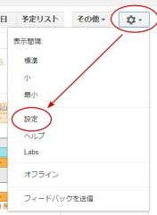
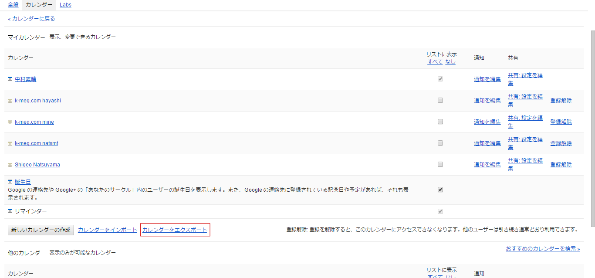
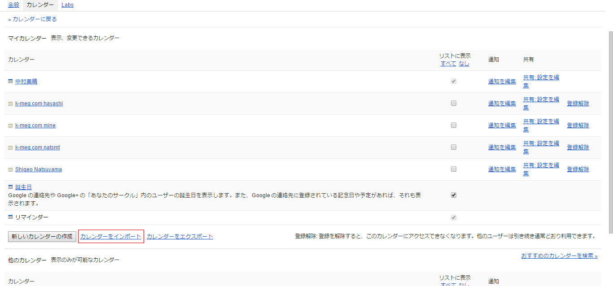
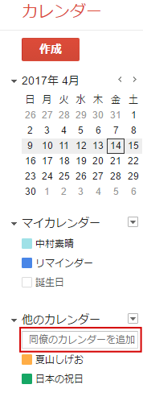

# スケジュールの共有について

スケジュールを社内全体で安全に共有する手順をまとめましたので、各自確認をお願いします。  
**各自登録していたGmailではなく、法人アカウントに各自ログインするGoogleAppsへ移行します**  
既存のデータを移行する必要が有る方は、書き出しと取り込みの手順を読み、スケジュールの移行を行ってください。  
移行の必要がない場合でも、「表示する方の登録」は人数分行って下さい。  
メールの受信パスワードがわからない方や、入れないという方は、私宛に連絡をお願いします。

## 現在使用しているカレンダーの書き出し(エクスポート)
### 1. 各個人で使用しているGoogleアカウントでログインをしてください。
### 2. カレンダーを表示し、設定画面に移動してください。

### 3. 設定画面のカレンダータブを選択してください。

### 4. 画面下の方にある、エクスポートをクリックし、エクスポートを行ってください。

### 5. エクスポートされたファイルは圧縮されていますので、解凍を行ってください。
**＊複数の方のカレンダーを共有している場合には、共有されている方のカレンダーも出力されます。**

## 会社用のカレンダーに取り込み(インポート)
### 1. 会社のアカウントでログインをしてください。
**会社のメールアドレスとメールを受信する際に使っているパスワードを入力してください**
### 2. カレンダーを表示し、設定画面に移動してください。

### 3. 設定画面のカレンダータブを選択してください。

### 4. 画面下の方にある、インポートをクリックし、先ほどエクスポートしたファイルを選択してください。
  
**＊他のカレンダーを参照している場合、複数のファイルがエクスポートされています。**　 
**自分のアカウント名のファイルを選択し、インポートを行ってください。**

## 表示する方の登録
### 1. 会社のアカウントでログインをしてください。
**＊既にアカウントは作成済みですので、会社のメールアドレスとメールを受信する際に使っているパスワードを入力してください**

### 2. カレンダーを表示してください
### 3. 画面左下の「同僚のカレンダーを追加」という部分に、登録したい方の**メールアドレス**を入力してください。

### 4. 参照したい方の数分、3を繰り替えし行い、登録を行ってください
